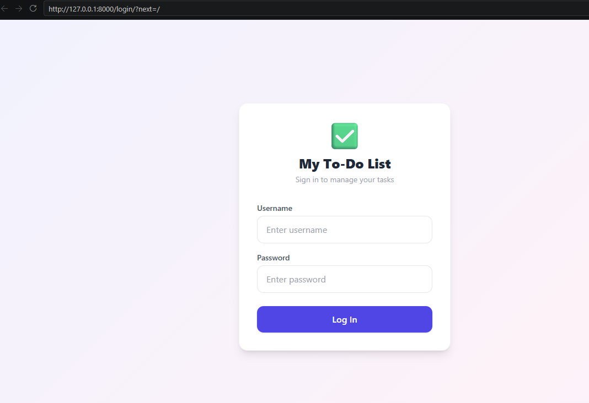
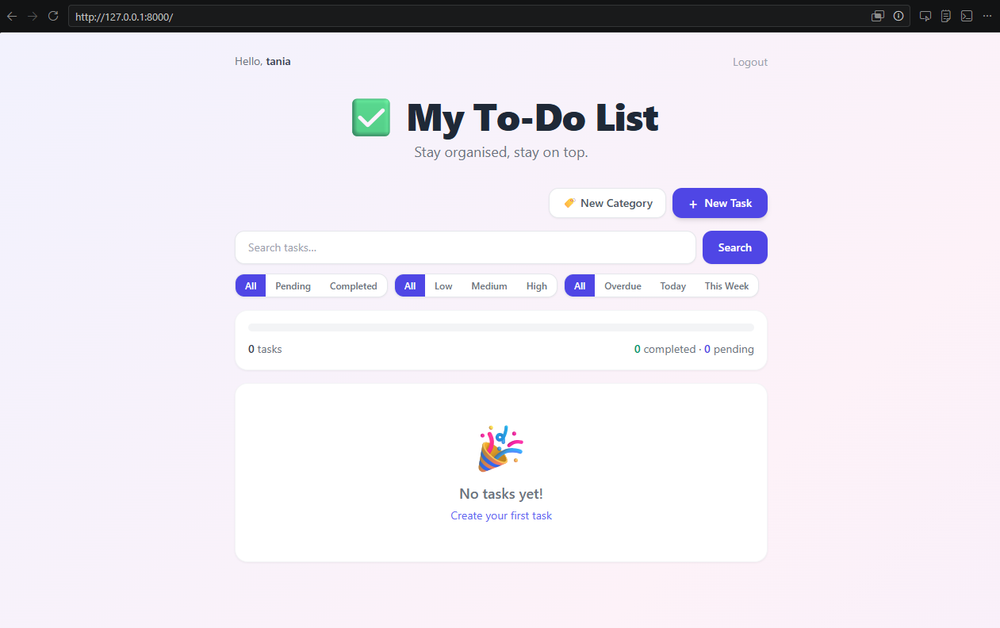
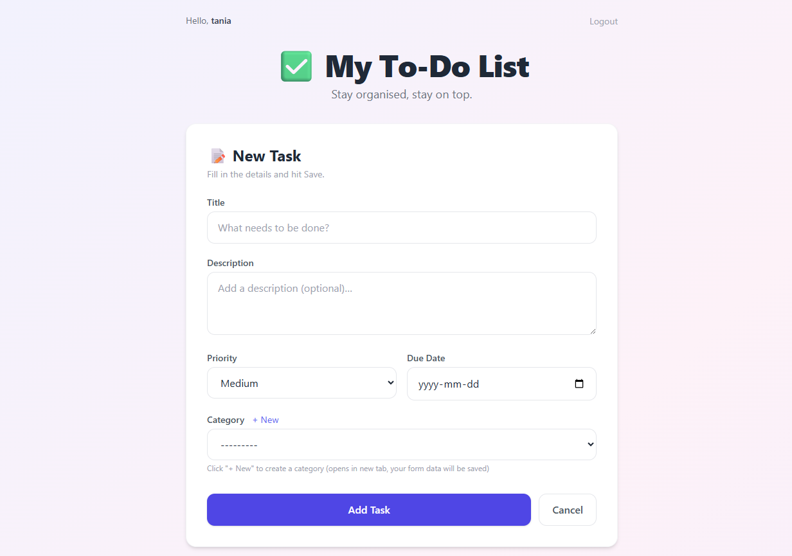
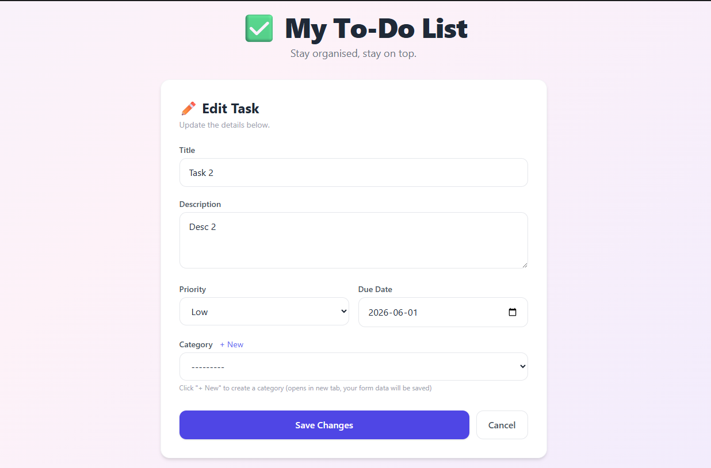
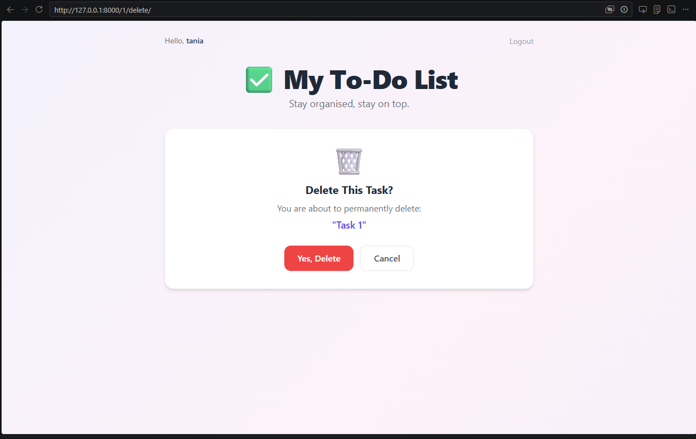
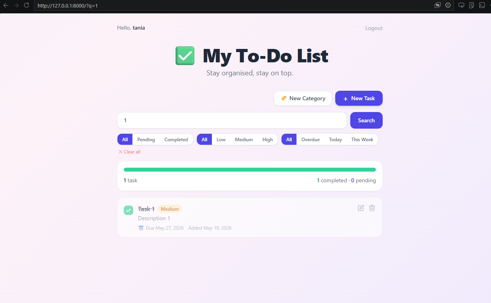

# 📌 Advanced Django To-Do App

A full-featured **task management web application** built with **Django, SQLite, and Tailwind CSS**, featuring authentication, categories, priorities, due dates, search, filtering, and Django admin control.

---

## 🚀 Features

### 👤 User System
- User registration & login
- Secure authentication
- Each user sees only their own tasks

### ✅ Task Management
- Create, update, delete tasks
- Mark tasks as completed
- Toggle task status instantly

### 🏷️ Categories
- Create custom categories (Work, Personal, Study, etc.)
- Assign tasks to categories
- User-specific category management

### 📅 Task Enhancements
- Due dates (calendar support)
- Priority levels (Low / Medium / High)
- Overdue detection

### 🔍 Search & Filtering
- Search tasks by title or description
- Filter by:
  - Status (All / Completed / Pending)
  - Priority
  - Category
  - Due date (Today / Overdue / This Week)

### 📊 Dashboard UI
- Task statistics (completed vs pending)
- Progress bar
- Clean responsive UI with Tailwind CSS

### 🛠️ Admin Panel
- Full Django admin integration
- Manage users, tasks, and categories
- Superuser control panel at `/admin/`

---

## 🧰 Tech Stack

- **Backend:** Django 5+
- **Database:** SQLite
- **Frontend:** HTML + Tailwind CSS
- **Auth:** Django Authentication System
- **UI Design:** Responsive modern layout

---

## 📂 Project Structure
```python
# 📌 Advanced Django To-Do App

A full-featured **task management web application** built with **Django, SQLite, and Tailwind CSS**, featuring authentication, categories, priorities, due dates, search, filtering, and Django admin control.

---

## 🚀 Features

### 👤 User System
- User registration & login
- Secure authentication
- Each user sees only their own tasks

### ✅ Task Management
- Create, update, delete tasks
- Mark tasks as completed
- Toggle task status instantly

### 🏷️ Categories
- Create custom categories (Work, Personal, Study, etc.)
- Assign tasks to categories
- User-specific category management

### 📅 Task Enhancements
- Due dates (calendar support)
- Priority levels (Low / Medium / High)
- Overdue detection

### 🔍 Search & Filtering
- Search tasks by title or description
- Filter by:
  - Status (All / Completed / Pending)
  - Priority
  - Category
  - Due date (Today / Overdue / This Week)

### 📊 Dashboard UI
- Task statistics (completed vs pending)
- Progress bar
- Clean responsive UI with Tailwind CSS

### 🛠️ Admin Panel
- Full Django admin integration
- Manage users, tasks, and categories
- Superuser control panel at `/admin/`

---

## 🧰 Tech Stack

- **Backend:** Django 5+
- **Database:** SQLite
- **Frontend:** HTML + Tailwind CSS
- **Auth:** Django Authentication System
- **UI Design:** Responsive modern layout

---

## 📂 Project Structure
todoproject/
│
├── manage.py
├── db.sqlite3
│
├── todoproject/ # Project settings
│ ├── settings.py
│ ├── urls.py
│
└── todos/ # Main app
├── models.py # Todo + Category models
├── views.py # Business logic
├── forms.py # Django forms
├── urls.py
├── admin.py # Admin panel config
└── templates/
└── todos/
├── base.html
├── todo_list.html
├── todo_form.html
├── login.html
├── category_form.html

```
---
---

## 📦 Installation

### 1. Clone repository
```bash
git clone https://github.com/Tania1011/advanced-django-todo-project.git
cd todoproject
```
---

### 2. Create a Virtual Environment

#### Windows

```bash
python -m venv venv
source venv\Scripts\activate
```

#### macOS/Linux

```bash
python3 -m venv venv
source venv/bin/activate
```

---

### 3. Install dependencies
```bash
pip install django
```
---


### 3. Create admin user
```bash
python manage.py createsuperuser
```

### 4. Apply migrations
```bash
python manage.py makemigrations
python manage.py migrate
```
---

### 5. Run the Development Server

```bash
python manage.py runserver
```

Open in browser:

```text
http://127.0.0.1:8000/
```

---

# Todos Model

```python
class Category(models.Model):
    name  = models.CharField(max_length=100, unique=True)
    owner = models.ForeignKey(
        settings.AUTH_USER_MODEL,
        on_delete=models.CASCADE,
        related_name='categories',
    )

    def __str__(self):
        return self.name


class Todo(models.Model):
    PRIORITY_CHOICES = [
        ('low',    'Low'),
        ('medium', 'Medium'),
        ('high',   'High'),
    ]

    title       = models.CharField(max_length=200)
    description = models.TextField(blank=True)
    completed   = models.BooleanField(default=False)
    priority    = models.CharField(max_length=6, choices=PRIORITY_CHOICES, default='medium')
    due_date    = models.DateField(null=True, blank=True)
    category    = models.ForeignKey(
        Category,
        on_delete=models.SET_NULL,
        null=True,
        blank=True,
        related_name='todos',
    )
    owner       = models.ForeignKey(
        settings.AUTH_USER_MODEL,
        on_delete=models.CASCADE,
        related_name='todos',
    )
    created_at  = models.DateTimeField(auto_now_add=True)
    updated_at  = models.DateTimeField(auto_now=True) 

```

---


# Screenshots

## Login Page



---

## Home Page



---

## Create New Task



---

## Update Task 



---


## Delete Task 



---


## Toggle Complete Task  



---